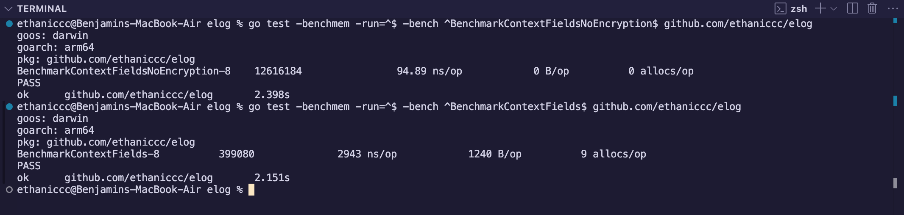

# elog
A logging library in Go w/ encryption. This library takes inspiration from [this](https://stackoverflow.com/questions/629755/creating-an-encrypted-log-file) StackOverflow thread.

## (But really,) WTF is this?
This logger library uses an idea from the StackOverflow thread above that an encrypted log should encrypt itself based off every entry. In this library, we use AES encryption (with the previous hash of the entry as the encryption key) to accomplish this. We also use a random seed that is generated by a function every log entry, and use this to generate the nonce. The nonce is then removed from the log output because when decrypting, we would be able to use the seed function to predict the nonce and get a nice decrypted log :>

## Why?
I need something to do while waiting an hour and thirty minutes for my next class to start. I should've chose a better schedule for my first semester!

## Features?
None, because I suck. In the future we might have
* Some more cool formatting stuff (because formatting is cool)
* ??? (feel free to make an issue for feature requests)

## Benchmark

